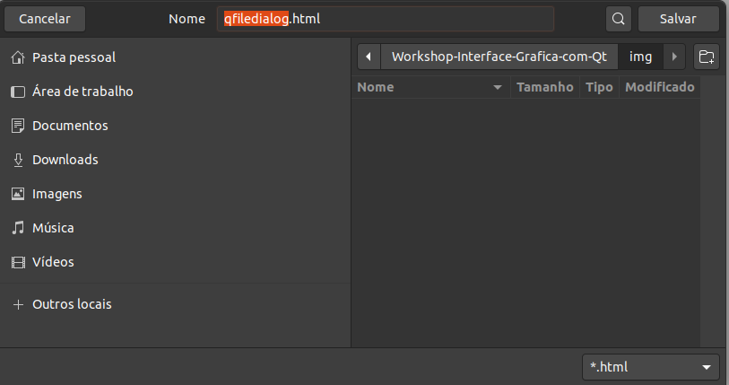

# Workshop para criação de interface gráfica com Qt

## Introdução

O Qt é um toolkit para desenvolvimento multiplataforma de aplicações em diversos domínios, com foco em execução nativa, excelente desempenho e produtividade. Isso significa que um mesmo código pode ser executado em diferentes sistemas operacionais (Windows, Linux, Mac OS), até em dispositivos móveis como Android e IOS. É uma tecnologia madura, com mais de duas décadas no mercado, mais de 1600 Classes implementadas, além de ter uma documentação excelente. Uma das suas principais características é a alta produtividade, com C++ e QML/JS, que está inclusa como uma linguagem que acelera a criação de aplicações específicas.

### QML

O QML é uma linguagem declarativa usada para descrever a interface do usuário do seu aplicativo. Com ela é possível criar interfaces de maneira simples e rápida, com elementos visuais que possuem uma capacidade gigantesca de personalização. Com essa linguagem é possível integrar JavaScript e C++ de maneira rápida, para aumentar a performance da construção tanto da interface quanto do back-end.

## Objetivo
O objetivo desse workshop é mostrar a criação de uma interface gráfica com elementos simples, além de criar uma pequena aplicação de player de áudio, para que os participantes tenham uma base e possam explorar cada vez mais a tecnologia.

## Elementos básicos da interface

### Botão

### Label

### Slider

### FileDialog

